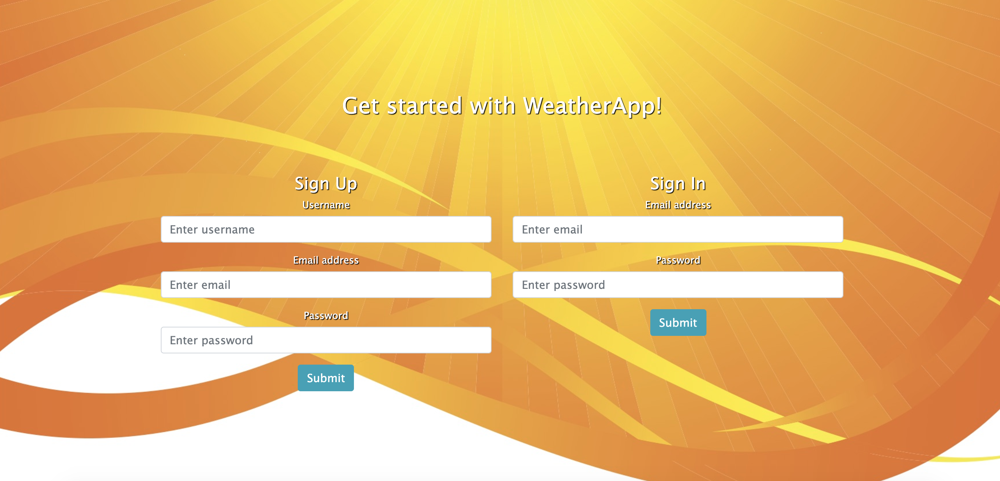
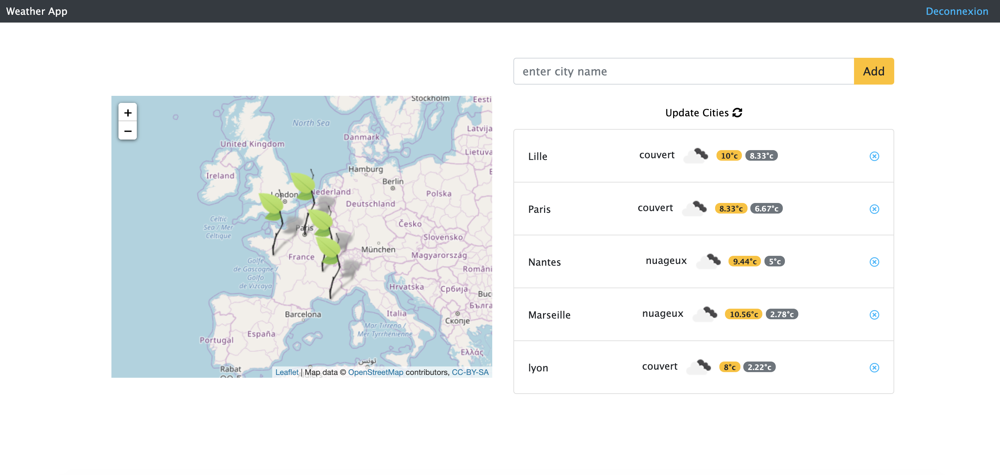

# WeatherApp

:sunny: WheatherApp est une application permettant d’afficher la météo :snowman: des villes :umbrella:

<h1 align="center">Weather App</h1>

<h2 align="center">
  
</h2>

<h2 align="center">
  
</h2>

# Wheather app, les fonctionnalités développées :

Création d'une application web permettant d’afficher la météo d’une ville sur une carte interactive.

# En terme de fonctionnalités :

- Mettre en place une interface utilisateur responsive
- Mettre en place un système de login utilisateur
- Mettre en place une zone de saisie permettant d’enregistrer une nouvelle ville
- Afficher les informations météorologiques d’une ville en temps réel
- Enregistrer durablement les informations d’un utilisateur (même après une coupure du serveur)
- Mettre en place une carte interactive matérialisant des villes saisies
